# How do I create an Oracle Object Storage Table in Query Service?
Duration: 10 minutes

In this sprint, you will create a table using a **Parquet** file that is stored in a public Object Storage bucket. You also create a table using a **.csv** file that is stored in a private Object Storage bucket. Finally, you will create two tables in Query Service using the Parquet and .csv files from the public and private buckets.

### Prerequisites
* An Oracle Cloud Account.
* A Data Catalog instance.
* A Query Service project.
* The required policies to allow access to the Data Catalog instance, Oracle Object Storage, and Query Service projects.

## **Create a Table Using a Parquet Data File in a Public Object Storage Bucket**  

The **PROJECT$** schema contains the tables that you create and manage using the Query Service interfaces such as the UI Console, SDKs, or the REST API. You can create your own tables in this schema. In this exercise, you will create a table over a Parquet file that is stored in a public Object Storage bucket that you will access using a URL.

### **Method 1: Create a Table Using an Object Storage File's URL**       

### **Create the Table**

1. Sign in to the Oracle Cloud Infrastructure Console using your tenancy, username, and password. On the **Console** Home page, open the **Navigation** menu and click **Analytics & AI**. Under **Data Lake**, click **Query Service**.

2. On the **Query Service Projects** page, in the row for your Query Service project, click **Query Editor**.

    

3. On the **Scratchpad** worksheet, click the **Select a Schema** drop-down list and select the **`PROJECT$`** schema, if not already selected.

    

4. Click **Create Table**. The **Create Table** page is displayed. Specify the following:

    + **Table Name:** Initially, accept the default name.

    + **Target Data Location:** Click **Copy** to copy the following URL, and then paste it in this field. This is the URL to access a **Parquet** file named **`custsales-2019-01.parquet`** which is stored in a public Oracle Object Storage bucket in a namespace named **c4u04** in the **us-ashburn-1** region.

        ```
        <copy>https://objectstorage.us-ashburn-1.oraclecloud.com/n/c4u04/b/moviestream_gold/o/custsales/month=2019-01/custsales-2019-01.parquet</copy>
        ```

        The **Properties**, **Column Mapping**, and **Table Preview** sections are displayed. All the columns are selected by default. This is controlled by the checkbox to the left of **Source Column** in the first table row.

    + **Table Name:** Replace the table name with **custsales\_public\_os\_parquet**.

      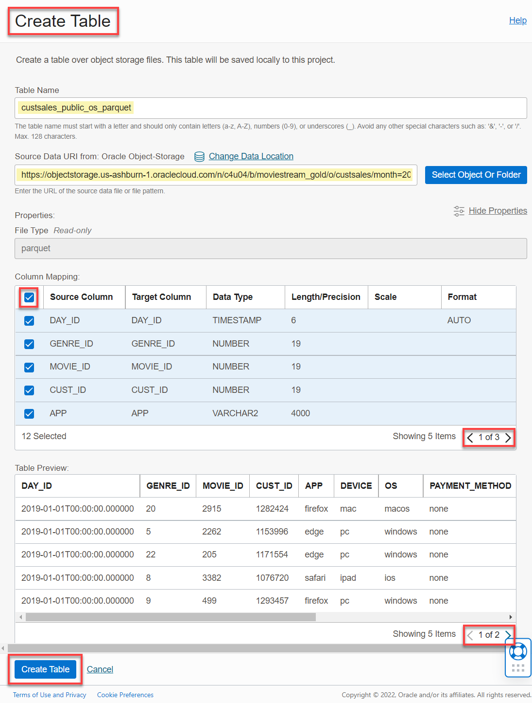    


5. Click **Create Table**. The table status shows as **Creating** (orange color) in the **Tables** section.

  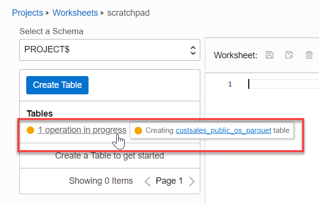

  If the table creation is successful, it is displayed in the **Tables** section.

     

### **View, Edit, and Query the Table**

6. Click the table's name link to view its details such as the columns names, columns Oracle data types, and state. Click **Close**.

    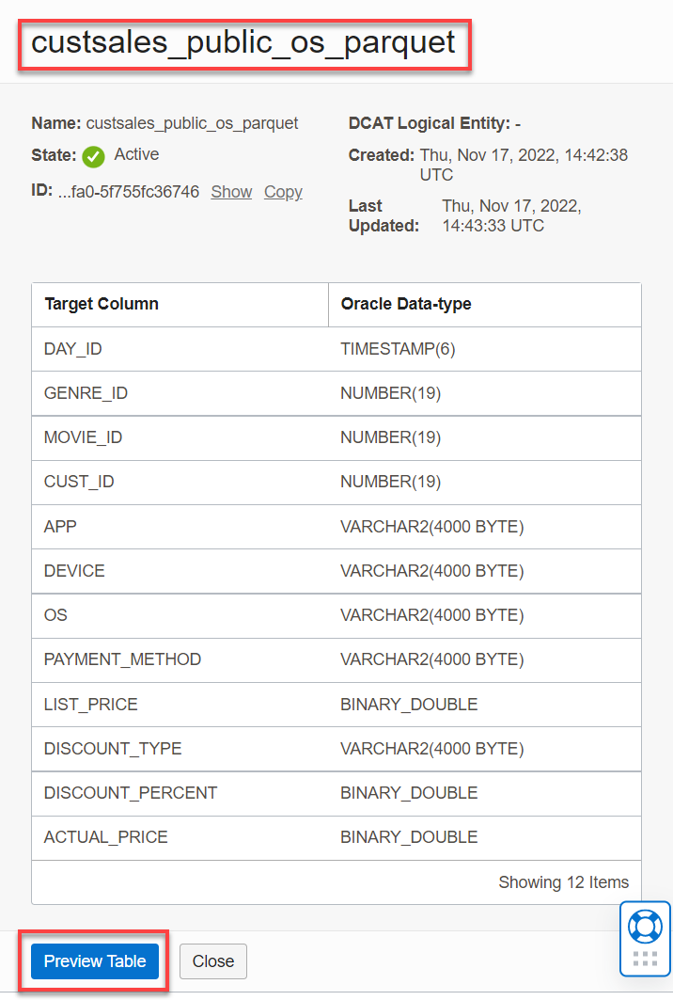   

7. Click the **Clear Editor** icon to delete the last query that you ran.

        

8. Use the horizontal scroll bar at the bottom of the **Tables** section to scroll to the right and view the **Actions** icon that is associated with the **custsales\_public\_os\_parquet** table.

  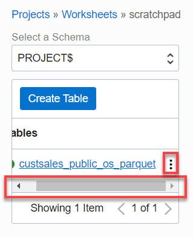  

  The **Actions** context menu is displayed. You can use this menu to query and view the table, copy the table's OCID, edit the table, and delete the table.

    

9. Click **Query**. The auto generated select query for this table is displayed in the **Scratchpad** query area.

    

10. Click **Run Query**. The query output is displayed in the **Last Query Result** tab.

    

11. Save the query to a worksheet. Click **Save**, and then select **Save Worksheet as** from the drop-down list.

  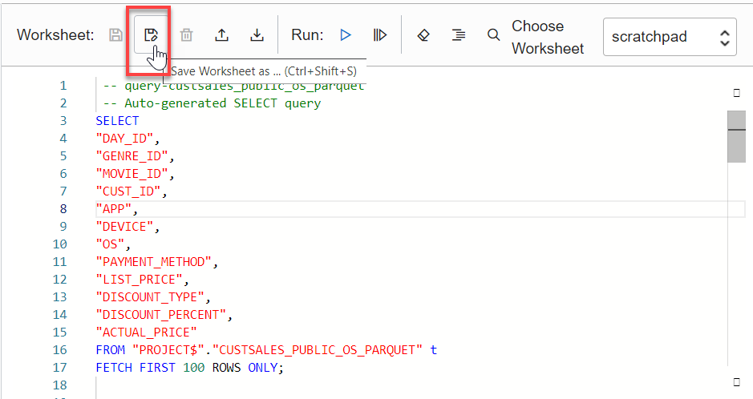  

12. Enter a meaningful name for the worksheet in the **Save Worksheet as** dialog box, and then click **Save As**.

    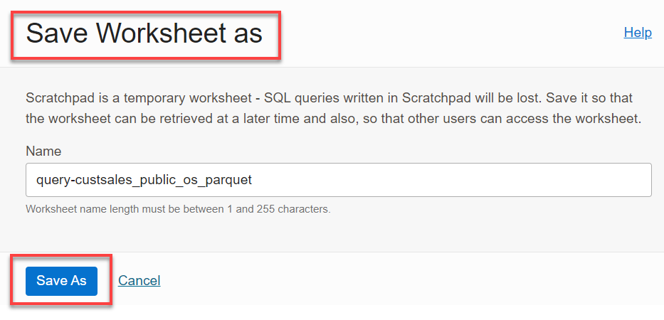

    The new worksheet is displayed.

    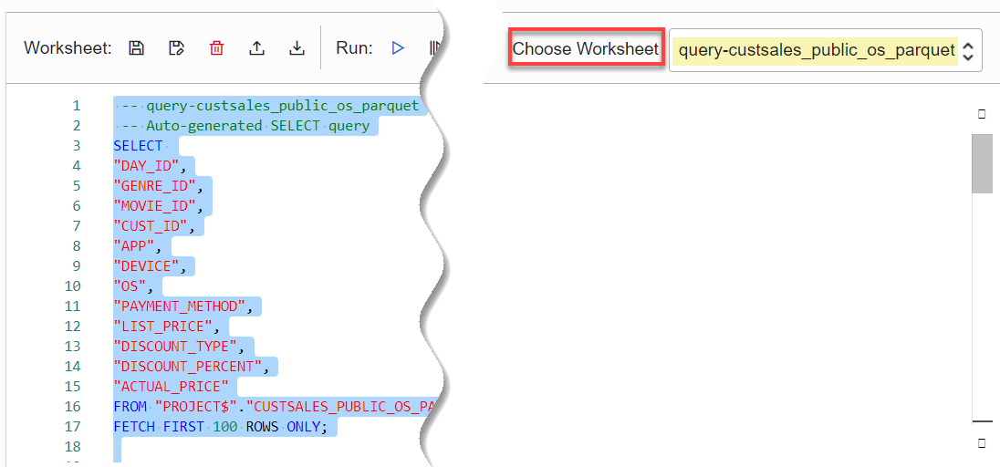  

### **Method 2: Create a Table by Choosing an Object Storage File**

You will first create an Object Storage bucket (unless you already have one) in your own tenancy, change its visibility from Private to Public, and then upload a local Parquet file to that bucket. Next, you will create a table by selecting the Parquet file from your Public Object Storage bucket.

### **Create an Object Storage Bucket and Change its Visibility to Public**

1. Sign in to the Oracle Cloud Infrastructure Console using your tenancy, username, and password. On the **Console** Home page, open the **Navigation** menu and click **Analytics & AI**. Under **Data Lake**, click **Query Service**.

2. Copy your web browser URL where you are running Query Service and paste it into a new browser tab.

3. In the new browser tab, open the **Navigation** menu in the Oracle Cloud console and click **Storage**. Under **Object Storage & Archive Storage**, click **Buckets**.

4. On the **Buckets** page, select the compartment where you want to create the bucket from the **Compartment** drop-down list in the **List Scope** section. Make sure you are in the region where you want to create your bucket.

5. Click **Create Bucket**.

6. In the **Create Bucket** panel, specify the following:
    - **Bucket Name:** Enter a meaningful name for the bucket.
    - **Default Storage Tier:** Accept the default **Standard** storage tier.
    - **Encryption:** Accept the default **Encrypt using Oracle managed keys**.

      

7. Click **Create** to create the bucket.

    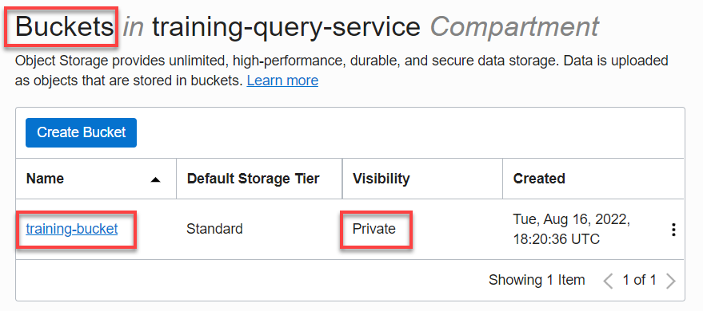  

8. Change the bucket's visibility setting from Private to Public. In the row for your newly created bucket, click the **Actions** icon. Select **Edit visibility** from the context menu.

    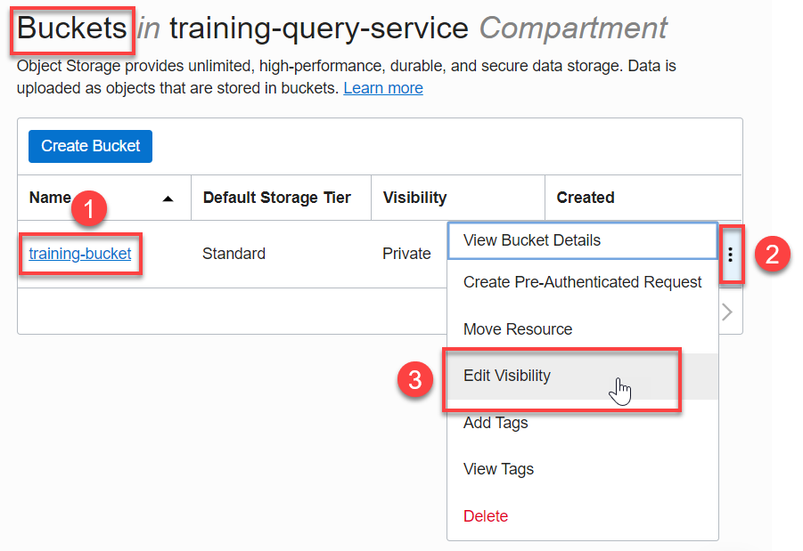  

9. In the **Edit visibility** dialog box, select the **Public** button, and then click **Save Changes**.

    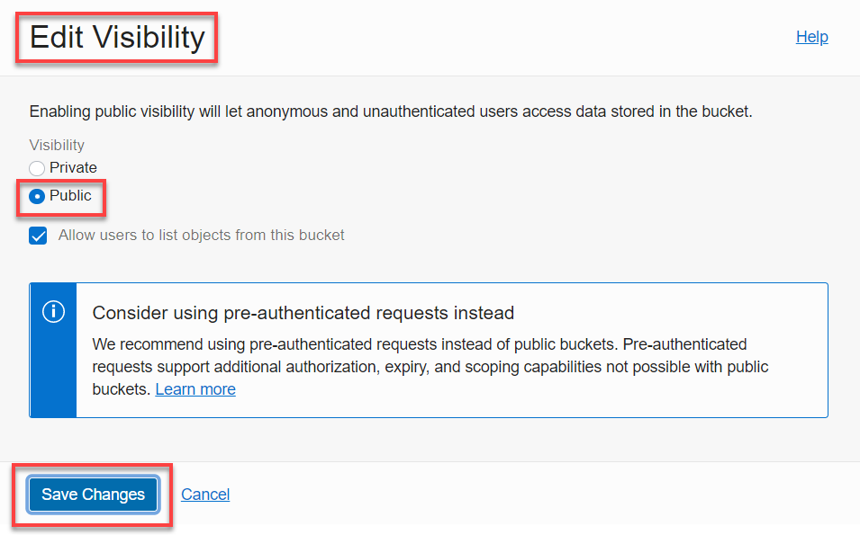  

10. The **Buckets** page is re-displayed. The **Visibility** of the bucket is now **Public**.

    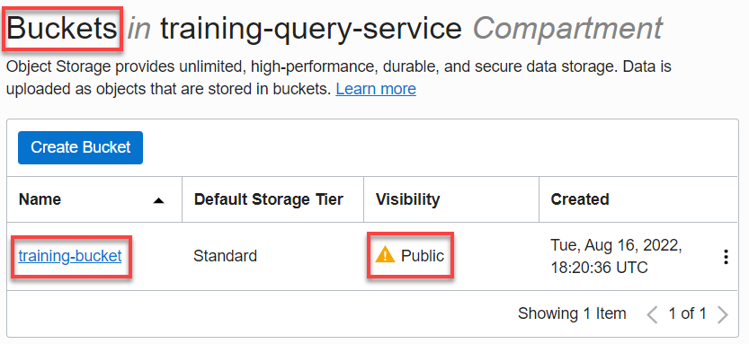  

### **Upload a Parquet File to Your Public Object Storage Bucket**

11. Download the **Parquet** file that you will use to create a new table in Query Service to Your local machine. Click the following link to download the [custsales-2019-01.parquet](files/custsales-2019-01.parquet?download=1) file.

12. On the **Buckets** page, click the bucket's name link to which you want to upload the files. The **Bucket Details** page is displayed.    

13. Scroll-down the page to the **Objects** section, and then click **Upload**.

14. In the **Upload Objects** panel, in the **Choose Files from your Computer** field, click **select files**. Navigate to the location where you downloaded the `custsales-2019-01.parquet` file and select it.

  

15. Click **Upload** to upload the selected file to the bucket.

16. When the file is uploaded, click **Close** to close the **Upload Objects** panel. The **Bucket Details** page is re-displayed. The newly uploaded file is displayed in the **Objects** section.

  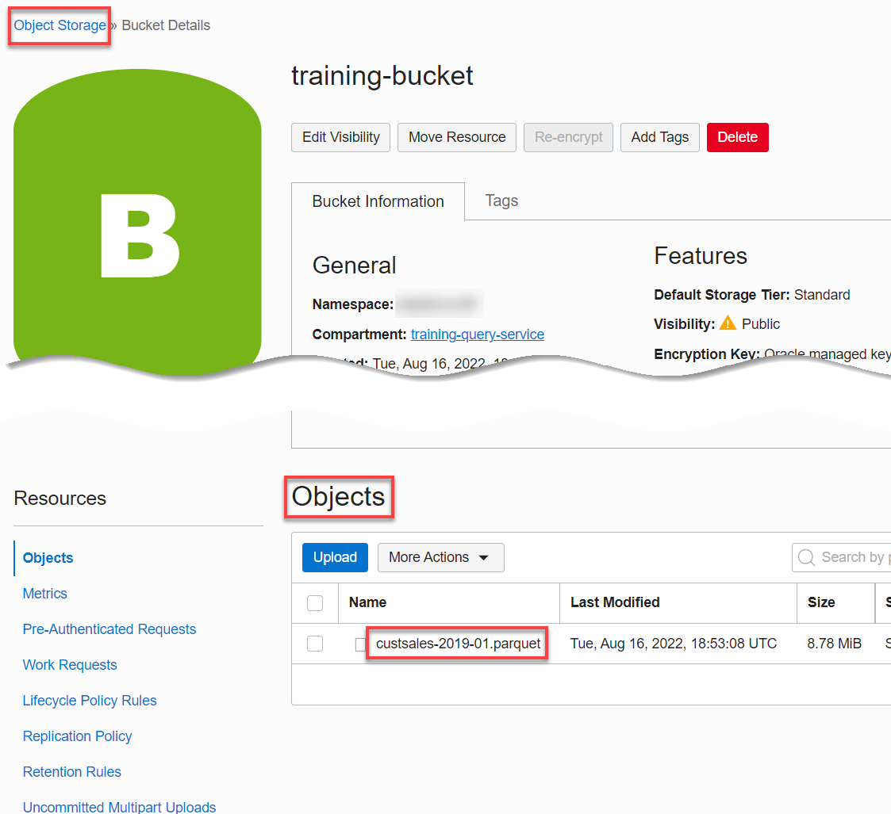

17. To return to the **Buckets** page, click **Object Storage** in the breadcrumbs.

18. Close the new web browser tab.

### **Create a Table Using the Parquet File in Your Public Bucket**

19. In the original web browser tab, navigate to the **Query Service Projects** page. In the row for your Query Service project, click **Query Editor**.

    

20. On the **Scratchpad**, click the **Select a Schema** drop-down list and select the **`PROJECT$`** schema, if not already selected.

  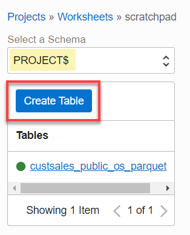  

21. Click **Create Table**. The **Create Table** page is displayed. Specify the following:

    + **Table Name:** Initially, accept the default name.      

    + **Target Data Location:** Click **Select Object** to select **`custsales-2019-01.parquet`** file from your Object Storage bucket. The **Select Object** panel is displayed. Click the filename link in the **Name** column.

      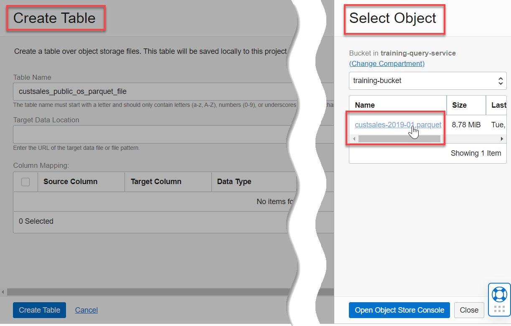    

      The **Object Details** panel is displayed. Click **Pick Object**.

      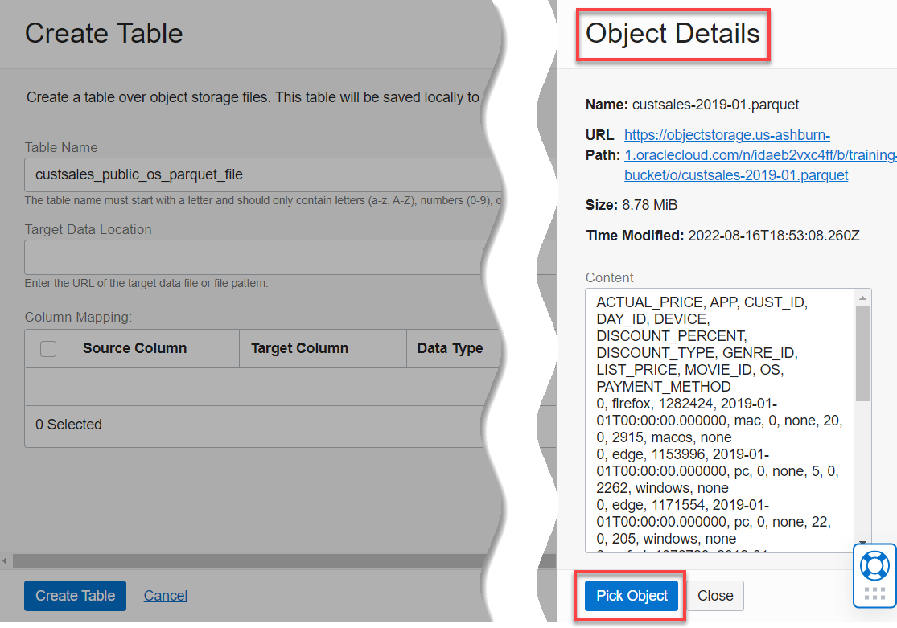      

      The Column Selection section is displayed.

      + **Table Name:** Replace the table name with **custsales\_public\_os\_parquet_file**.

      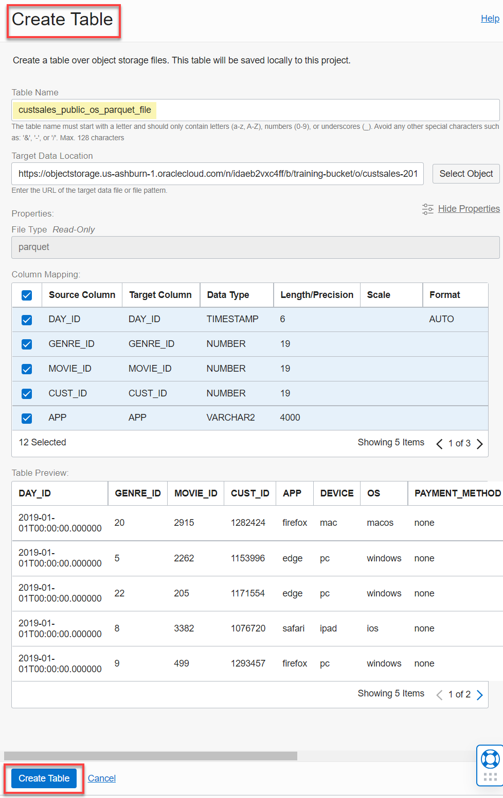    

22. Click **Create Table**. The table status shows as **Creating** (orange color) in the **Tables** section.

  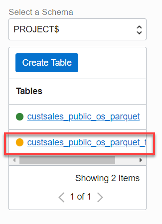

  If the table creation is successful, it is displayed in the **Tables** section.

  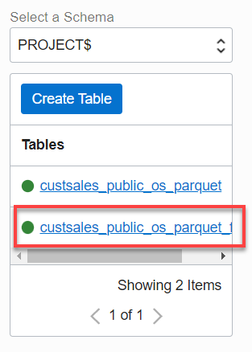   

## **Create a Table Using a .csv Data File in a Private Object Storage Bucket**  

You will first create a private Object Storage bucket (unless you already have one) in your own tenancy and then upload a local .csv file to that bucket. Next, you will create a table in the **PROJECT$** schema using the **.csv** file in your private Object Storage bucket.

### **Create a Private Object Storage Bucket and Upload a .csv File to the Bucket**

1. Sign in to the Oracle Cloud Infrastructure Console using your tenancy, username, and password. On the **Console** Home page, open the **Navigation** menu and click **Analytics & AI**. Under **Data Lake**, click **Query Service**.

2. Copy your web browser URL where you are running Query Service and paste it into a new browser tab.

3. In the new browser tab, open the **Navigation** menu in the Oracle Cloud console and click **Storage**. Under **Object Storage & Archive Storage**, click **Buckets**.

4. On the **Buckets** page, select the compartment where you want to create the bucket from the **Compartment** drop-down list in the **List Scope** section. Make sure you are in the region where you want to create your bucket.

5. Click **Create Bucket**.

6. In the **Create Bucket** panel, enter a meaningful name for the bucket name in the **Bucket Name** field. Accept the defaults for the rest of the fields, and then click **Create** to create the bucket. The new private bucket is displayed on the **Buckets** page.

  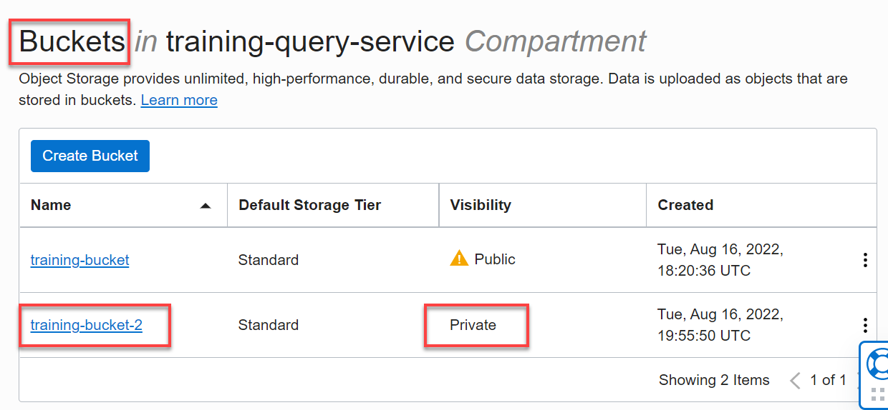

7. Download the **.csv** file that you will use to create a new table in Query Service to your local machine. Click the following link to download the [weather_weather-newark-airport.csv](files/weather_weather-newark-airport.csv?download=1) file into a location of your choice.

8. On the **Buckets** page, click the private bucket's name link. The **Bucket Details** page is displayed.

9. Upload the **`weather_weather-newark-airport.csv`** file to your private Object Storage bucket. Scroll-down the page to the **Objects** section, and then click **Upload**.

10. In the **Upload Objects** panel, click the **select files** link. In the **Open** dialog box, navigate to the location where you downloaded the **`weather_weather-newark-airport.csv`**, select it, and then click **Open**. The file is displayed in the **Upload Objects** panel.

  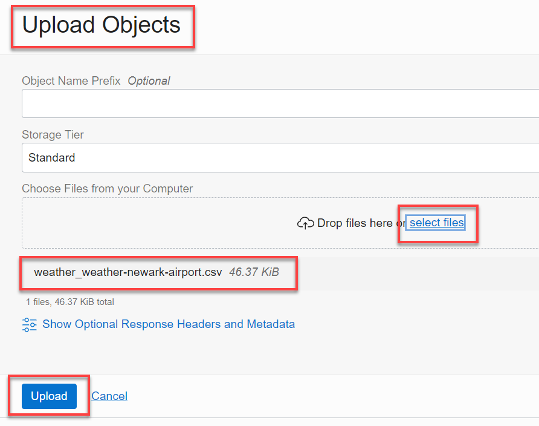

11. Click **Upload** to upload the selected file to the bucket. When the file is uploaded, click **Close** to close the **Upload Objects** panel. The **Bucket Details** page is re-displayed. The newly uploaded file is displayed in the **Objects** section.

  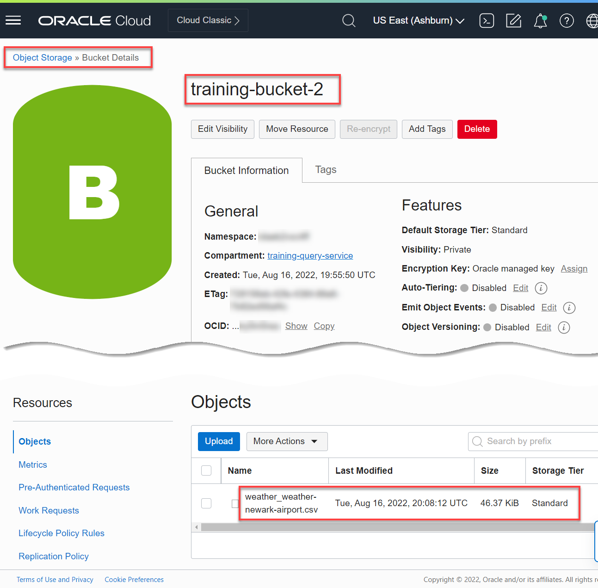

12. To return to the **Buckets** page, click **Object Storage** in the breadcrumbs.

13. Close the new web browser tab.

### **Create a Table in the PROJECT$ Schema Using the .csv File in Your Private Bucket**

14. In the original web browser tab, navigate to the **Query Service Projects** page, if not already there. In the row for your Query Service project, click **Query Editor**.

    

15. On the **Scratchpad**, click the **Select a Schema** drop-down list and select the **`PROJECT$`** schema, if not already selected. Click **Create Table**.

  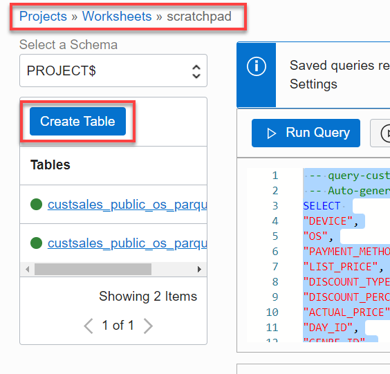    

16. In the **Create Table** page, specify the following:

    + **Table Name:** Initially, accept the default name. Once you select the target data location, you will change the table name.

    + **Target Data Location:** Click **Select Object** in the **Target Data Location** row. The **Select Object** panel is displayed. Click the **Bucket** drop-down list to select your private Object Storage bucket that contains the .csv file. In the **Name** section, click the **`weather_weather-newark-airport.csv`** filename link.

      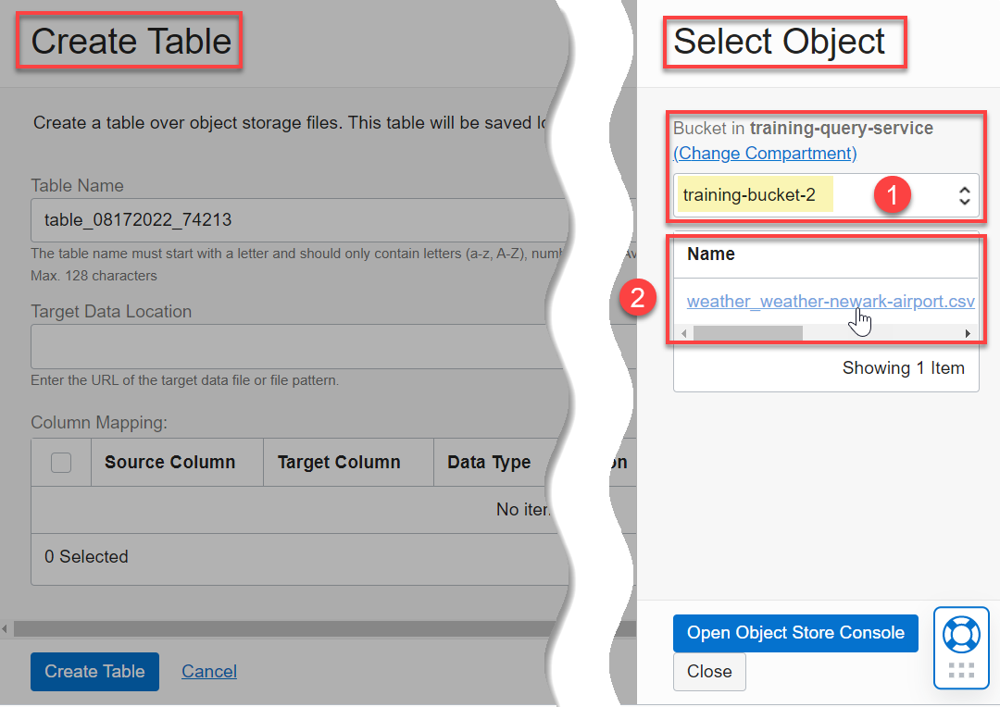    

    + The **Object Details** panel is displayed. Click **Pick Object**.

      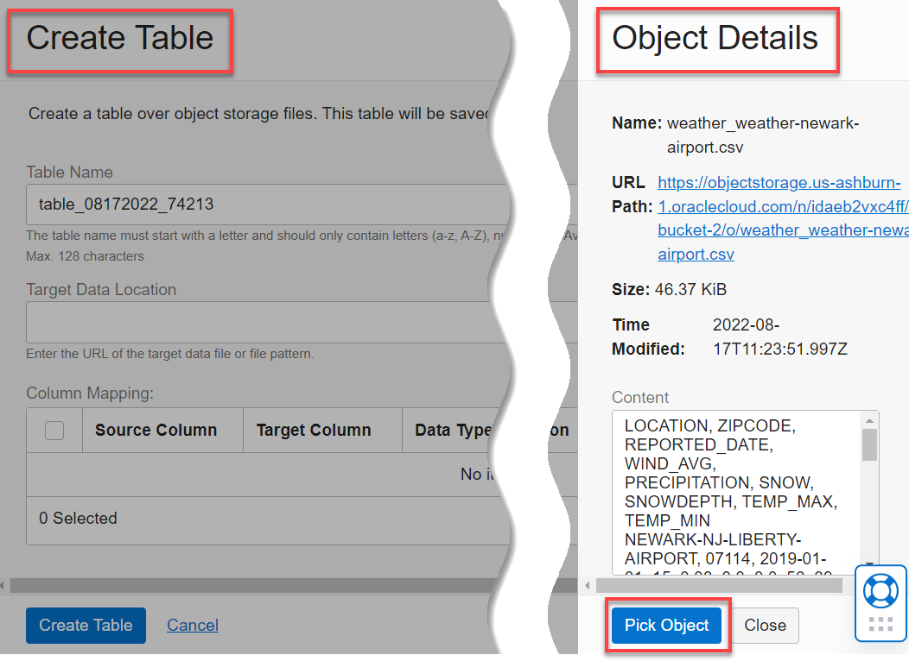      

      The **Create Table** page is re-displayed. In the **Table Name** field, enter **weather\_private\_os\_csv**. The **Properties**, **Column Mapping**, and **Table Preview** sections are displayed.

          

17. In the **Source column name** section, select the **Get from file header** check box. In the **Formatted Column** section, select the **Convert invalid data to null** check box.

      

      The columns' names are derived from the .csv file header row. Cells that contain zeros will be replaced with a null.

      

18. Click **Create Table**. The table status shows as **Creating** (orange color) in the **Tables** section.

  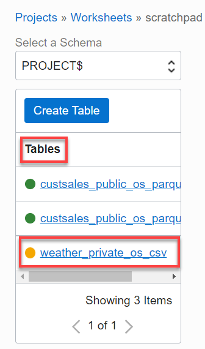

  If the table creation is successful, it is displayed in the **Tables** section.

  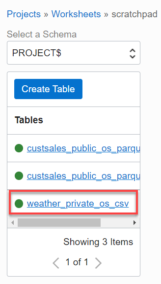   

## Learn More

* [Signing In to the Console](https://docs.cloud.oracle.com/en-us/iaas/Content/GSG/Tasks/signingin.htm).
* [Creating a Bucket and Uploading Files to a Bucket](https://docs.oracle.com/en-us/iaas/Content/GSG/Tasks/addingbuckets.htm#Putting_Data_into_Object_Storage)
* [Data Catalog Documentation](https://docs.oracle.com/en-us/iaas/data-catalog/home.htm)
* [Data Catalog Policies](https://docs.oracle.com/en-us/iaas/data-catalog/using/policies.htm)
* [Oracle Cloud Infrastructure Documentation](https://docs.oracle.com/en-us/iaas/Content/GSG/Concepts/baremetalintro.htm)
* [Access the Data Lake using Autonomous Database and Data Catalog Workshop](https://apexapps.oracle.com/pls/apex/dbpm/r/livelabs/view-workshop?wid=877)
* [DBMS_DCAT Package](https://docs-uat.us.oracle.com/en/cloud/paas/exadata-express-cloud/adbst/ref-dbms_dcat-package.html#GUID-4D927F21-E856-437B-B42F-727A2C02BE8D)
* [RUN_SYNC Procedure](https://docs.oracle.com/en/cloud/paas/autonomous-database/adbsa/ref-running-synchronizations.html#GUID-C94171B4-6C57-4707-B2D4-51BE0100F967)
* [Using Oracle Autonomous Database on Shared Exadata Infrastructure](https://docs.oracle.com/en/cloud/paas/autonomous-database/adbsa/index.html)
* [Connect with Built-in Oracle Database Actions](https://docs.oracle.com/en/cloud/paas/autonomous-database/adbsa/sql-developer-web.html#GUID-102845D9-6855-4944-8937-5C688939610F)

## Acknowledgements
* **Author:** Lauran Serhal, Consulting User Assistance Developer, Oracle Autonomous Database and Big Data
* **Contributors:**
    + Alexey Filanovskiy, Senior Principal Product Manager
    + Ravi Ramkissoon, Software Development Director
* **Last Updated By/Date:** Lauran Serhal, August 2022
